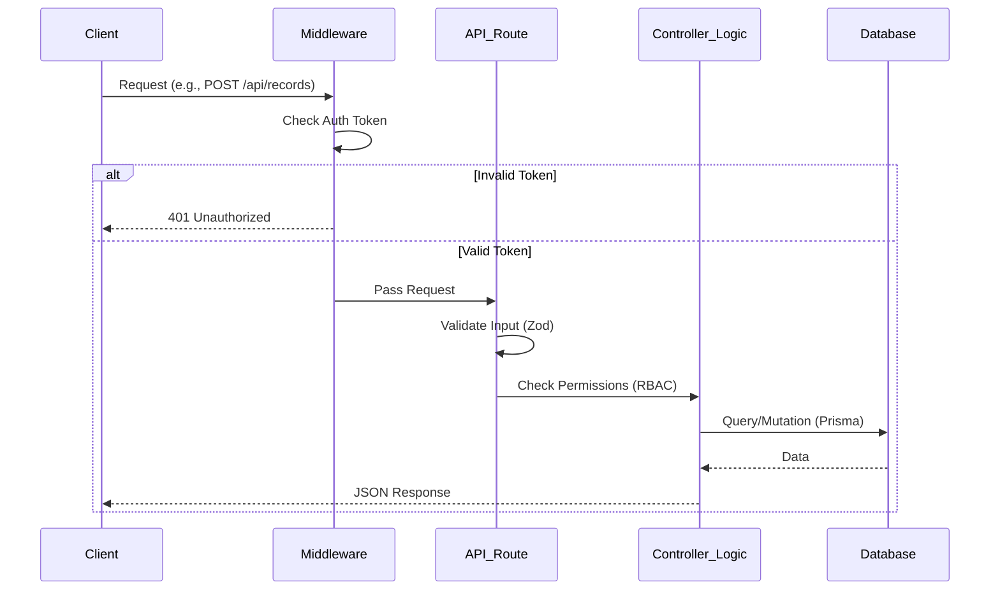
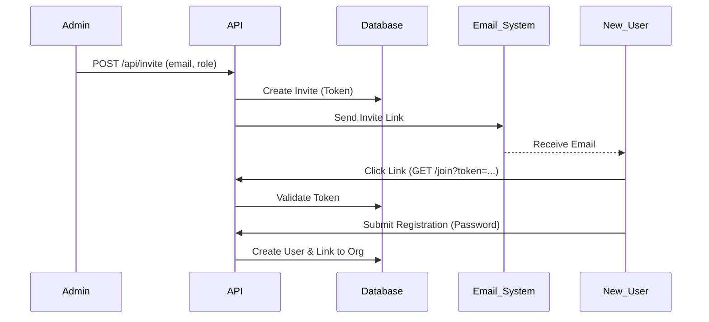
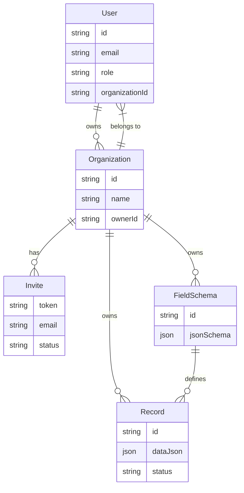

# Backend Architecture Documentation

This documentation provides a comprehensive overview of the backend architecture for the ID Card Generator platform. It is designed to help developers understand the system's structure, data flow, and key components.

## 1. High-Level Overview

The backend is built using **Next.js 16 (App Router)**, leveraging Server Actions and API Routes for logic. It uses **Prisma ORM** to interact with a **PostgreSQL** database. Authentication is handled by **NextAuth.js (v4)** using JWT sessions.

The system is designed with **Multi-Tenancy** at its core. Every user belongs to an `Organization`, and all data (Schemas, Records, Templates) is scoped to that organization.

### Key Technologies
- **Framework**: Next.js 16
- **Database**: PostgreSQL
- **ORM**: Prisma
- **Auth**: NextAuth.js (Credentials Provider)
- **Validation**: Zod
- **Styling**: Tailwind CSS

---

## 2. Authentication & Role-Based Access Control (RBAC)

Authentication is managed via `src/lib/auth.ts` and enforced globally via `src/middleware.ts`.

### How it Works
1.  **Login**: Users submit email/password to `/api/auth/signin`.
2.  **Verification**: The system hashes the password (bcrypt) and compares it with the stored hash.
3.  **Session**: On success, a **JWT (JSON Web Token)** is generated containing the user's `id`, `email`, `role`, and `organizationId`.
4.  **Middleware Protection**: The `middleware.ts` file intercepts requests to protected routes (e.g., `/admin`, `/api/admin`). If no valid token is present, it redirects to login.

### Roles (`UserRole` Enum)
- **SUPER_ADMIN**: System-wide control (can manage organizations).
- **ADMIN**: Organization owner (can invite users, manage schemas/records).
- **USER**: Standard member (can view/submit records depending on permissions).

---

## 3. Request Lifecycle

Every API request follows this general flow:

---

## 4. Folder & File Structure Explanation

The backend logic is distributed across `app/api`, `lib`, and `utils`.

### `src/app/api/` (API Routes)
These folders map directly to URL endpoints.
-   **`auth/[...nextauth]/route.ts`**: Handles login, logout, and session management.
-   **`register/route.ts`**: Handles new organization signups. Creates a User + Organization transactionally.
-   **`invite/route.ts`**: Allows Admins to generate invite tokens for new members.
-   **`schemas/route.ts`**: CRUD for dynamic field schemas (the "blueprint" for ID cards).
-   **`records/route.ts`**: Handles data submission for ID cards.
-   **`records/export/route.ts`**: Generates CSV exports of submitted records.

### `src/lib/` (Core Logic)
-   **`auth.ts`**: NextAuth configuration. Defines providers, callbacks, and session strategy.
-   **`db.ts`**: Singleton instance of Prisma Client to prevent connection exhaustion during hot-reloads.
-   **`invite.ts`**: Helper functions for the invite system (`createInvite`, `validateInvite`, `acceptInvite`).

### `src/utils/` (Helpers)
-   **`generatedToken.ts`**: (Placeholder) Utility for token generation.
-   **`permission.ts`**: (Placeholder) Centralized permission checking logic.

---

## 5. API Routes Breakdown

### 1. Registration (`POST /api/register`)
-   **Purpose**: Creates a new User and a new Organization.
-   **Input**: `{ name, email, password, orgName }`
-   **Logic**:
    1.  Checks if email exists.
    2.  Hashes password.
    3.  **Transaction**: Creates User -> Creates Org -> Updates User with `orgId`.
-   **Response**: `{ id, email }`

### 2. Create Schema (`POST /api/schemas`)
-   **Purpose**: Defines the structure of an ID card (e.g., Name, ID Number, Department).
-   **Input**: `{ name, jsonSchema: { ... } }`
-   **Logic**: Validates input and saves to `FieldSchema` table, linked to the user's Organization.

### 3. Submit Record (`POST /api/records`)
-   **Purpose**: Saves actual user data based on a schema.
-   **Input**: `{ schemaId, dataJson: { ... } }`
-   **Logic**:
    1.  Verifies `schemaId` belongs to the user's Org.
    2.  Saves data to `Record` table.

### 4. Export Records (`GET /api/records/export?schemaId=...`)
-   **Purpose**: Download data as CSV.
-   **Logic**: Fetches records for the schema -> Flattens JSON data -> Returns CSV stream.

---

## 6. Invite Flow

The system uses a token-based invitation flow to add users to existing organizations.

### Flow Description
1.  **Admin** calls `POST /api/invite` with `{ email, role }`.
2.  System generates a secure random token and saves it to the `Invite` table.
3.  (Future) System sends an email with a link: `app.com/join?token=xyz`.
4.  **User** clicks link -> Frontend calls `validateInvite(token)`.
5.  User sets a password -> System creates User account linked to the Org -> Updates Invite status to `ACCEPTED`.

---

## 7. Dynamic Schema & Form Flow

The platform allows admins to define custom data structures for ID cards without changing code.

1.  **Schema Builder**: Admin defines fields (Text, Image, Date) -> Saved as JSON in `FieldSchema`.
    *   *Example JSON*: `{ "name": "string", "employeeId": "number" }`
2.  **Data Entry**: Frontend fetches Schema -> Renders Form -> User submits data.
3.  **Storage**: Data is saved as a JSON blob in the `Record` table (`dataJson` column).

---

## 8. Database Schema (ERD)

Based on `prisma/schema.prisma`:

---

## 9. Summary: How Everything Connects

1.  **Organization is Key**: Everything starts with an Organization. Users, Schemas, and Records are all children of an Org.
2.  **Flexible Data**: Instead of hardcoding columns for "Employee ID" or "Department", we use `FieldSchema` (definition) and `Record` (data) with JSON columns. This allows the app to support any type of ID card.
3.  **Security**: `middleware.ts` ensures only logged-in users access the app. API routes further check `organizationId` to ensure tenants cannot see each other's data.

### Next Steps for Development
-   **Implement Email Sending**: Connect `src/lib/invite.ts` to an email provider (Resend/SendGrid).
-   **Build Invite Acceptance Page**: Create a page that consumes the invite token.
-   **Enhance Validation**: Add JSON Schema validation inside `POST /api/records` to ensure submitted data matches the `FieldSchema`.
